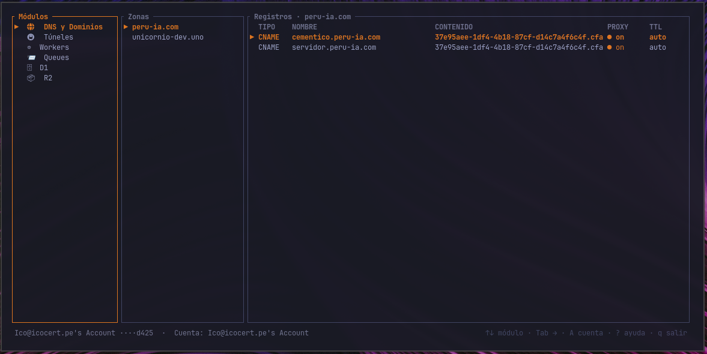
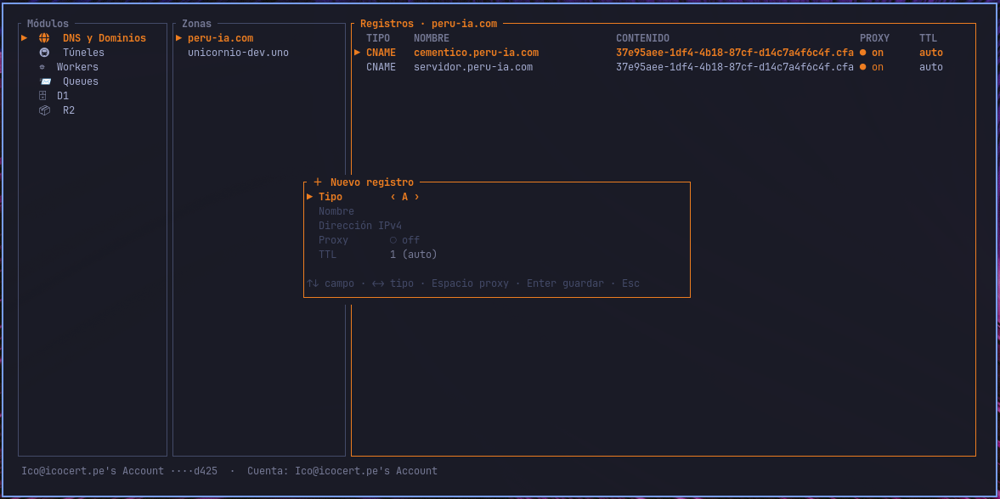
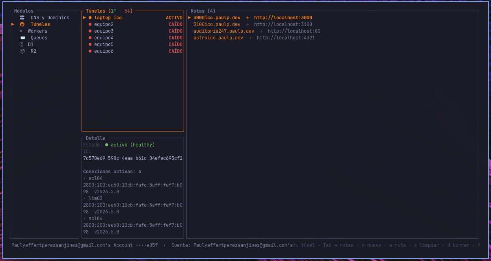
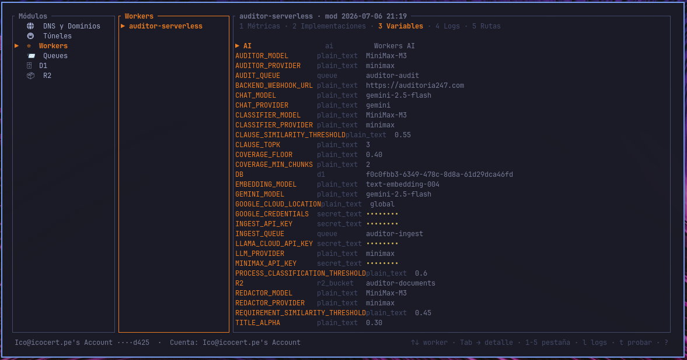
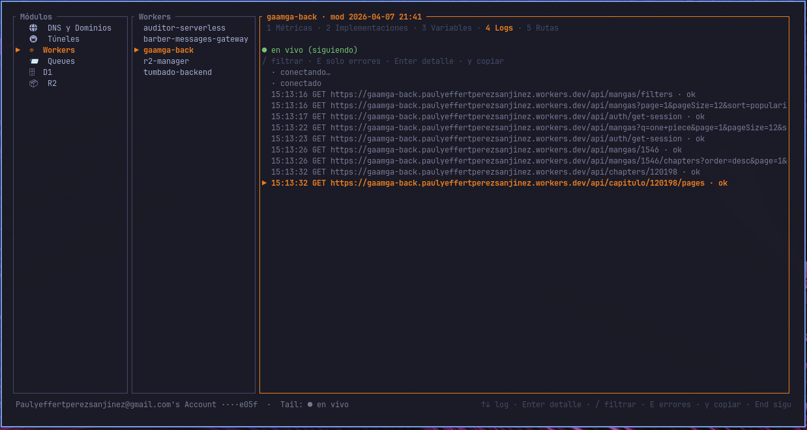
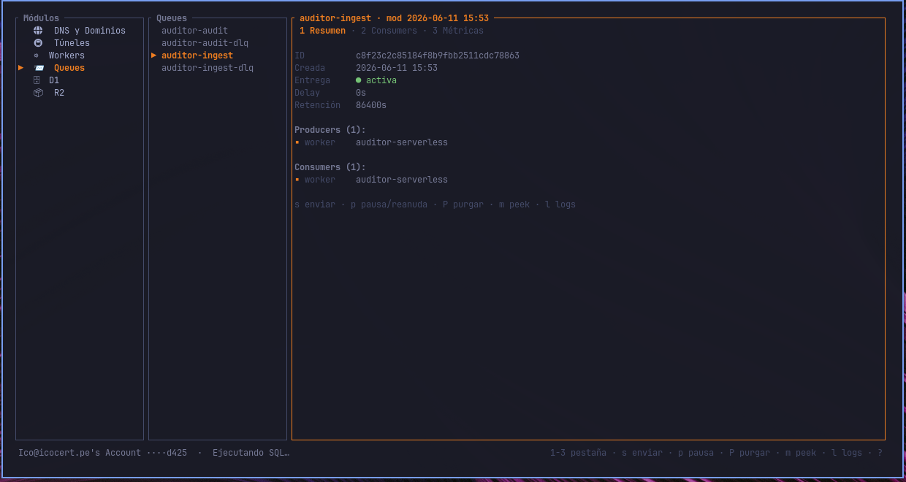
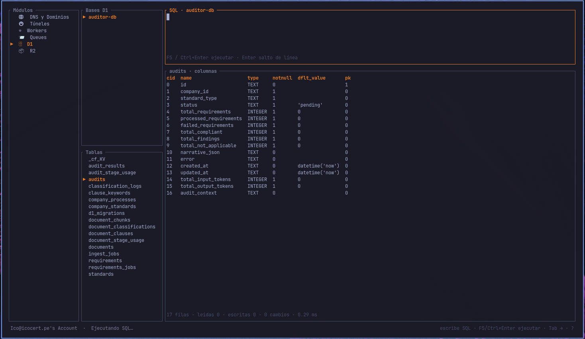
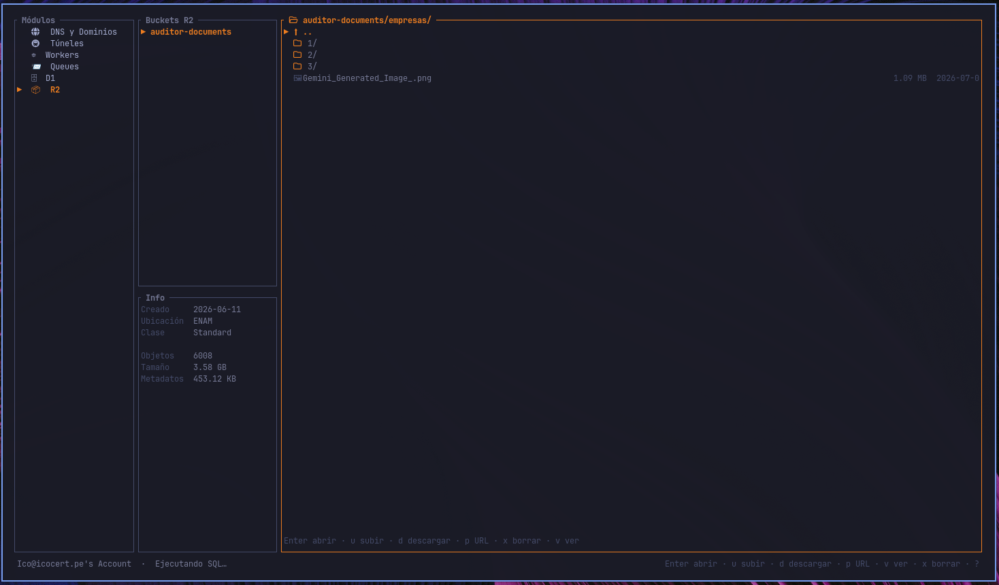
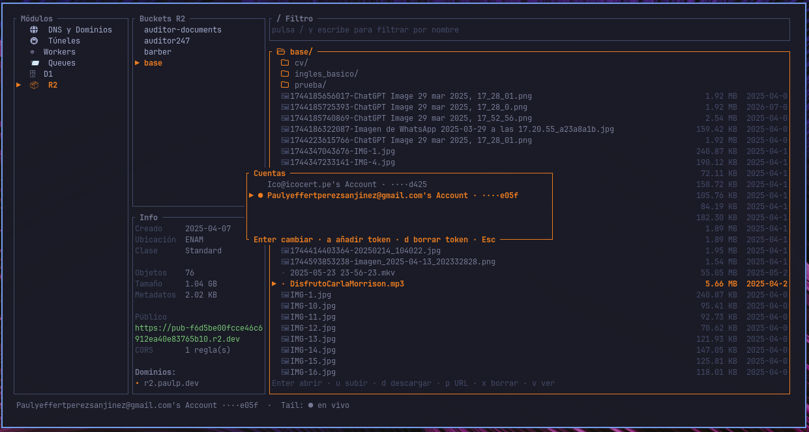

```text
██╗      █████╗ ███████╗██╗   ██╗ ██████╗███████╗
██║     ██╔══██╗╚══███╔╝╚██╗ ██╔╝██╔════╝██╔════╝
██║     ███████║  ███╔╝  ╚████╔╝ ██║     █████╗
██║     ██╔══██║ ███╔╝    ╚██╔╝  ██║     ██╔══╝
███████╗██║  ██║███████╗   ██║   ╚██████╗██║
╚══════╝╚═╝  ╚═╝╚══════╝   ╚═╝    ╚═════╝╚═╝
```

TUI estilo inspirado en **lazydocker**, escrita en Rust + [ratatui](https://ratatui.rs), para administrar
[Cloudflare](https://cloudflare.com) desde la terminal sin abrir el dashboard web.

Módulos: **DNS/Dominios**, **Túneles** (Zero Trust), **Workers**, **Queues**, **D1**, **R2**.

Navegación estilo lazydocker (paneles, atajos de teclado, sidebar de recursos), llamadas a la API
de Cloudflare 100% async (no bloquea la UI), y soporte multi-cuenta con selector de cuenta activa.
Cada módulo tiene su tabla de atajos más abajo, y dentro de la app `?` muestra la ayuda
contextual del panel activo.

## Instalación

```sh
npm install -g lazycf
```

El instalador descarga el binario nativo para tu sistema (Linux x64, macOS Intel/Apple Silicon, Windows x64) desde las [releases de GitHub](https://github.com/PaulPPS632/lazycf/releases).

## Uso

```sh
lazycf
```
O desde el código fuente:

```sh
cargo run
```

```sh
cargo run -- --log lazycf.log   # escribe logs a archivo (por defecto no loggea)
```
## Authenticacion

Dos formas de autenticarte (conviven; multi-sesión):

- **Login con Cloudflare (OAuth)** — método por defecto: pulsa `Enter` en la
  pantalla de autenticación, se abre el navegador, apruebas el acceso y listo.
- **API Token** — pulsa `t` en la pantalla de autenticación : dashboard → *My Profile → API Tokens → Create Token → Create Custom Token*.

Las credenciales se guardan en el keyring del sistema, nunca en texto plano.

> **OAuth y R2:** las URLs prefirmadas siguen necesitando credenciales S3 de R2
> (ver más abajo); la cobertura de Tunnels/R2 vía OAuth depende de los scopes
> que apruebe tu cuenta.

## Requisitos

### Scopes (permisos) necesarios

Cada módulo de lazycf mapea a un permiso del token. Agrega solo los que uses;
si falta uno, ese módulo devuelve `403` pero el resto sigue funcionando.

#### A nivel de cuenta (*Account*)

| Scope | Por qué |
| --- | --- |
| **Account Settings** · Read | Listar tus cuentas y verificar el token (`/accounts`, `/accounts/{id}/tokens/verify`) para el selector de cuenta activa. |
| **Workers Scripts** · Edit | Módulo Workers: listar scripts, deployments, subdominio, dominios, ver/editar variables y secretos, rollback de deployments. |
| **Workers Tail** · Read | Logs en vivo de Workers (live-tail por WebSocket). |
| **D1** · Edit | Módulo D1: listar bases, y ejecutar SQL (incluye escrituras) en el editor. |
| **Workers R2 Storage** · Edit | Módulo R2: buckets, uso, objetos (subir/descargar/borrar/renombrar), CORS y dominios. |
| **Queues** · Edit | Módulo Queues: listar/crear/borrar colas, consumidores, publicar y purgar mensajes. |
| **Cloudflare Tunnel** · Edit | Módulo Túneles (Zero Trust): listar, crear, editar ingress, limpiar conexiones y borrar túneles. |
| **Account Analytics** · Read | Métricas 24h de Workers y Queues (sparklines) vía GraphQL. |

#### A nivel de zona (*Zone*)

| Scope | Por qué |
| --- | --- |
| **Zone** · Read | Módulo DNS: listar tus zonas/dominios (`/zones`). |
| **DNS** · Edit | Módulo DNS: listar, crear, editar, borrar registros y toggle de proxy. |
| **Workers Routes** · Read | Pestaña Rutas del módulo Workers: rutas de Worker por zona. |
| **Cache Purge** · Purge | Purga de caché de una zona (`/zones/{id}/purge_cache`). |

> **R2 (URLs prefirmadas / SigV4):** el explorador de objetos usa la API de Cloudflare
> (token Bearer), pero las URLs prefirmadas requieren además credenciales **S3 de R2**
> (Access Key ID + Secret) generadas aparte en *R2 → Manage R2 API Tokens*.


```sh
export CLOUDFLARE_API_TOKEN="<tu-token>"
```

## Módulos

### DNS y Dominios





- Zonas de la cuenta activa (izquierda) + tabla de registros de la zona seleccionada (derecha).
- Crear y editar registros con **formulario dinámico por tipo** (A, AAAA, CNAME, TXT, MX):
  los campos cambian según el tipo (prioridad en MX, proxy solo en proxiables, TTL con `auto`).
- **Toggle de proxy** (nube naranja) con confirmación, borrado de registros con confirmación.
- **Purga de caché** de la zona completa (con confirmación).

| Panel | Tecla | Acción |
| --- | --- | --- |
| Zonas | `p` | Purgar caché de la zona completa (con confirmación) |
| Registros | `a` / `e` | Añadir / editar registro (formulario dinámico por tipo) |
| | `Espacio` | Proxy on/off (A / AAAA / CNAME, con confirmación) |
| | `d` | Borrar registro (con confirmación) |
| | `p` | Purgar caché de la zona |

### Túneles



- Lista de túneles `cloudflared` con **estado en vivo** (healthy / degraded / down / inactive)
  y conexiones activas por datacenter.
- Crear túnel (muestra el token para el connector) y borrarlo; limpiar conexiones colgadas.
- **Rutas públicas (ingress)** estilo dashboard: "agregar aplicación publicada" con
  subdominio + zona de la cuenta — **crea el CNAME automáticamente**. Editar servicio/ruta
  y borrar rutas sin romper el resto del config.

| Panel | Tecla | Acción |
| --- | --- | --- |
| Túneles | `n` | Nuevo túnel (muestra el token para el connector) |
| | `a` | Añadir ruta pública — crea el CNAME automáticamente |
| | `c` | Limpiar conexiones colgadas (con confirmación) |
| | `d` | Borrar túnel (con confirmación) |
| Rutas | `a` | Añadir ruta pública (+ DNS) |
| | `e` | Editar servicio / ruta |
| | `d` | Borrar ruta (con confirmación) |

---

### Workers





- Lista de scripts + detalle con **5 pestañas**:
  - **Métricas** — requests, errores, CPU p50/p99 y sparkline 24 h (GraphQL), tasa de error coloreada.
  - **Implementaciones** — historial de deployments; **rollback** al deployment seleccionado (con confirmación).
  - **Variables** — variables y secretos; editar valores y añadir secretos nuevos (endpoint seguro).
  - **Logs** — **live-tail por WebSocket** (protocolo `trace-v1`): filtro en vivo (`/`),
    solo-errores (`E`), seguir el final (`End`), Enter abre el **detalle del evento**
    (request, headers, logs, excepciones) y `y` copia el JSON crudo.
  - **Rutas** — rutas de Worker por zona + custom domains apuntando al script.
- **Probar una ruta** (`t`): GET con código de estado y latencia; sugiere la URL `workers.dev`.

| Panel | Tecla | Acción |
| --- | --- | --- |
| Lista y detalle | `1-5` / `← →` | Cambiar de pestaña (Métricas · Impl. · Variables · Logs · Rutas) |
| | `l` | Live-tail de logs on/off |
| | `t` | Probar una ruta (GET con estado y latencia) |
| Detalle | `Enter` | Rollback del deployment (Impl.) · detalle del evento (Logs) |
| | `e` / `a` | Editar variable / añadir secreto (pestaña Variables) |
| | `/` | Filtro de logs en vivo (método / URL / mensaje) |
| | `E` | Mostrar solo errores (Logs) |
| | `y` | Copiar el JSON crudo del evento (Logs) |
| | `End` | Seguir el final del tail (Logs) |

### Queues



- Lista de colas (⏸ marca las pausadas) + detalle con **3 pestañas**:
  - **Resumen** — settings (delay, retención, estado de entrega), producers y consumers.
  - **Consumers** — configuración completa; **editar** batch, retries, delay, DLQ,
    concurrencia/wait (worker) o visibility timeout (HTTP pull).
  - **Métricas** — backlog actual + sparklines de backlog y mensajes ingeridos (24 h, GraphQL).
- Crear y borrar colas; **enviar mensajes** (texto o JSON, con delay opcional);
  **pausar/reanudar** la entrega y **purgar** mensajes (todo con confirmación).
- **Peek de mensajes** en colas HTTP pull (`m`, sin ack — reaparecen tras el visibility timeout).
- `l` salta al módulo Workers con el **live-tail del consumer** ya arrancado.

| Tecla | Acción |
| --- | --- |
| `1-3` / `← →` | Cambiar de pestaña (Resumen · Consumers · Métricas) |
| `n` / `d` | Nueva cola / borrar cola (con confirmación) |
| `s` | Enviar mensaje (texto o JSON, con delay opcional) |
| `p` / `P` | Pausar-reanudar la entrega / purgar mensajes (con confirmación) |
| `m` | Peek de mensajes (solo colas HTTP pull, sin ack) |
| `l` | Live-tail del consumer (salta al módulo Workers) |
| `e` / `Enter` | Editar consumer — batch, retries, DLQ (pestaña Consumers) |

---

### D1



- Bases y tablas (vía `sqlite_master`); ↑↓ sobre una tabla muestra sus columnas (PRAGMA).
- **Editor SQL multilínea** con **autocompletado contextual** (keywords, tablas, columnas,
  y columnas por alias — `t.` sugiere las de esa tabla/subquery). F5 / Ctrl+Enter ejecuta.
- **LIMIT automático** en consultas sin límite propio + tope de 2 000 filas con aviso de
  truncado — la rejilla vuela aunque la tabla tenga 100 000 registros.
- Resultados en **rejilla estilo hoja de cálculo**: navegación por celda, ver el valor
  completo (Enter), copiar celda (`y`) o fila TSV (`Y`).
- Barra **WHERE** con autocompletado (columnas del resultado): filtra la tabla actual
  **o la última consulta libre** (se envuelve como subquery).

| Panel | Tecla | Acción |
| --- | --- | --- |
| Tablas | `↑ ↓` | Navegar tablas — muestra las columnas de cada una (PRAGMA) |
| | `Enter` | `SELECT * FROM tabla LIMIT 50` |
| Editor SQL | `F5` / `Ctrl+Enter` | Ejecutar la consulta |
| | `Enter` | Salto de línea (editor multilínea) |
| | `Ctrl+Espacio` | Abrir autocompletado (keywords, tablas, columnas y alias `t.`) |
| | `Tab` / `Enter` | Aceptar sugerencia (con el popup abierto) |
| | `↑ ↓` / `Esc` | Navegar / cerrar sugerencias |
| Barra WHERE | `Enter` | Aplicar el filtro (a la tabla actual o a la última consulta) |
| | `Ctrl+Espacio` | Autocompletado con las columnas del resultado |
| Resultados | `↑ ↓ ← →` / `h j k l` | Navegar celda a celda |
| | `PgUp` / `PgDn` | Desplazar filas de 10 en 10 |
| | `Enter` | Ver el valor completo de la celda |
| | `y` | Copiar la celda al portapapeles |
| | `Y` | Copiar la fila completa (TSV) |

---

### R2



- Buckets (crear/borrar) + panel de **uso** (peso, nº de objetos, ubicación, clase).
- **Navegador de objetos** por carpetas con paginación, filtro instantáneo (`/`) y
  **búsqueda profunda** en todo el bucket (`s`).
- Subir, descargar (a ~/Descargas), renombrar, **mover** (editando la clave), nueva carpeta,
  metadatos (`i`), marcar múltiples (`Espacio`) y **borrado masivo** (con confirmación).
- **Preview de imágenes en la terminal** (`v`, medias celdas RGB).
- URLs: abrir/copiar con dominio público `r2.dev` o **dominios personalizados**
  (conectar/quitar desde la TUI), y **URLs prefirmadas SigV4** (credenciales S3 en el keyring).
- Editor de **política CORS** (JSON) y toggle del dominio público `r2.dev`.

| Panel | Tecla | Acción |
| --- | --- | --- |
| Buckets | `n` / `d` | Crear / borrar bucket (con confirmación) |
| | `c` | Editar la política CORS (JSON) |
| | `p` | Dominio público `r2.dev` on/off |
| | `t` | Dominios personalizados (conectar / quitar) |
| Objetos | `Enter` | Abrir carpeta / ver imagen |
| | `Backspace` / `h` | Subir un nivel (o salir de la búsqueda) |
| | `/` | Filtro instantáneo de la carpeta actual |
| | `s` | Búsqueda profunda en todo el bucket |
| | `Espacio` | Marcar / desmarcar múltiples objetos |
| | `u` / `n` | Subir un archivo local / nueva carpeta |
| | `d` | Descargar a `~/Descargas` y abrir |
| | `o` / `y` | Abrir en el navegador / copiar URL del objeto |
| | `i` | Metadatos del objeto |
| | `e` / `m` | Renombrar / mover (editando la clave completa) |
| | `p` | URL prefirmada SigV4 (pide credenciales R2 una sola vez) |
| | `v` | Preview de la imagen en la terminal |
| | `x` | Borrar objeto o marcados (con confirmación) |

### Transversal



- **Multi-cuenta y multi-token**: selector de cuenta activa (`A`), tokens en el keyring del sistema.
- **Temas** seleccionables: Cloudflare (por defecto), Everforest y Tokyo Night. Se eligen en el primer arranque y desde la pantalla de configuración (`,`); se guardan en `config.toml`.
- **Mouse completo**: click enfoca y selecciona, scroll navega cualquier panel.
- Ayuda contextual (`?`) con los atajos del panel activo; barra de estado con hints.
- Render bajo demanda: CPU ≈ 0 en reposo.

#### Atajos globales

| Tecla | Acción |
| --- | --- |
| `Tab` / `⇧Tab` | Cambiar de panel |
| `↑ ↓` / `k j` | Navegar el panel activo |
| `Enter` | Acción principal del panel |
| `r` | Recargar los datos del panel activo |
| `A` | Selector de cuenta activa |
| `,` | Pantalla de configuración (tema, cuentas, idioma) |
| `?` | Ayuda contextual con los atajos del panel activo |
| `q` / `Ctrl-C` | Salir |
| Mouse | Click enfoca y selecciona; scroll navega cualquier panel |

> En los paneles de texto (editor SQL, barra WHERE, filtros) el teclado escribe:
> solo `Tab` / `⇧Tab` salen del panel, así `q` o `?` no interrumpen lo que tecleas.